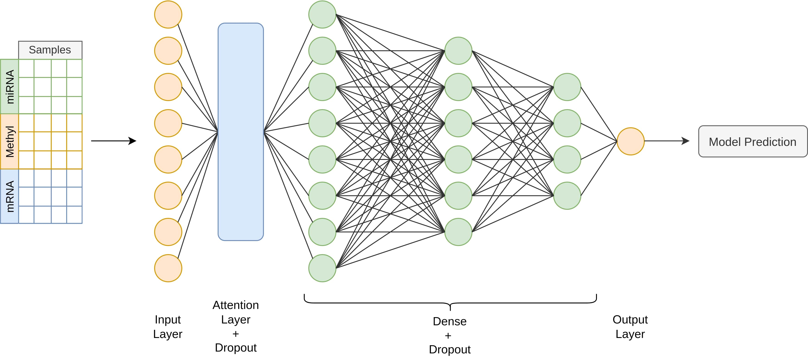

# PlainNN

## A simple feed-forward neural network can outperform Graph Convolutional Networks for patient classification through Multi-Omics Integration

### PlainNN Architecture

### Files and folders
*BRCA*: Folder containing datasets for BRCA classification task, originally from the MOGONET repository.

*ROSMAP*: Folder containing datasets for ROSMAP classification task, originally from the MOGONET repository.

*MOGONET_Trials/Train_Test_BRCA.ipynb*: Code for 1000 runs cross-validation procedure on BRCA, adapted from the MOGONET repository.

*MOGONET_Trials/Train_Test_ROSMAP.ipynb*: Code for 1000 runs cross-validation procedure on ROSMAP, adapted from the MOGONET repository.

*PlainNN/PlainNN_EarlyFusion.ipynb*: Code for the PlainNN model, performing early fusion on input data.

### References

[1] Wang T., Shao W., Huang Z. et al., MOGONET integrates multi-
omics data using graph convolutional networks allowing patient classifica-
tion and biomarker identification., in *Nature Communication*, 3445, 2021,
https://doi.org/10.1038/s41467-021-23774-w

MOGONET original code can be found at https://github.com/txWang/MOGONET.
